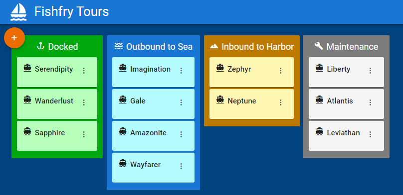

# Fishfry Tours

# Documentation
To view published project, navigate to [ostruk-fishfry-tours.herokuapp.com](https://ostruk-fishfry-tours.herokuapp.com/)

## Architecture
### Backend
The backend is written with Node.js and Express.

[api.js](src/api.js) contains all REST endpoints that serve the app.

[utils.js](src/utils.js) contains a utility function that validates if a boat is valid.

[db.js](src/db.js) contains an in-memory database implementation in the form of an array. In production this would be replaced with a SQL database.

### Testing
Tests are perfomed using the Junit library and are written for both the backend and the frontend portions of the project.

#### Backend testing
Backend tests are contained in [__tests__](__tests__) folder. 

[boat-api.test.js](__tests__/boat-api.test.js) file contains functional tests that verify functionality of all use cases. This is done using [supertest](https://github.com/visionmedia/supertest#readme) library. Tests verify that API endpoints return correct response code and verify that in-memory array used to store data updates correctly.

[db.test.js](__tests__/db.test.js) and [utils.test.js](__tests__/utils.test.js) files contain unit tests that verify functionality of utils.js and db.js files, respectively.

#### Frontend testing
Frontend tests are contained in the [app-test.js](front/src/__tests__) file. They are DOM tests written with the help of [React's Testing Library](https://testing-library.com/). Axios requests to the API are mocked using Jest's mock function. Tests verify that the board gets rendered with all the items as well as use case functionality by simulating user interactions such as clicking buttons and entering text into input fields.

Other functional tests could be written using [snapshot approach](https://jestjs.io/docs/snapshot-testing) provided by Jest as well as individual component testing and unit tests.
